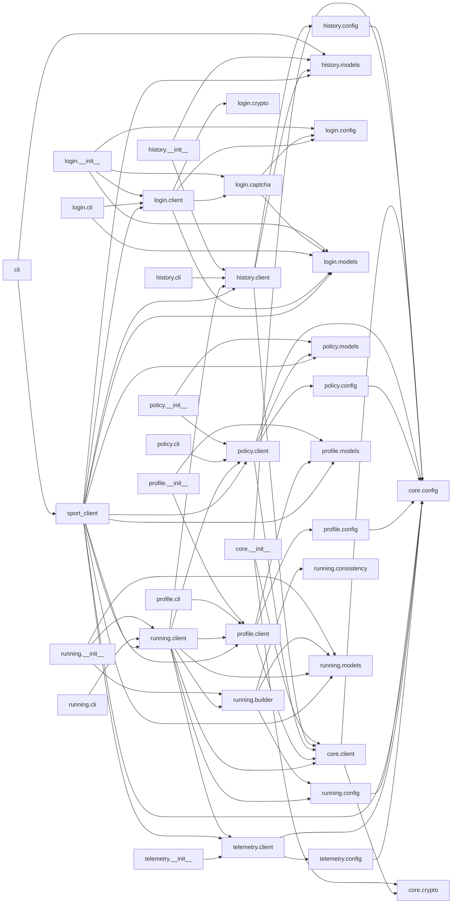

# 实际文件导入依赖图

覆盖指定九个模块的全部 Python 文件；下图为静态内部导入边，标准库、Node/浏览器和 ads 依赖另见主报告。`sys.path` 动态注入仍可能影响运行时解析。

```mermaid
flowchart LR
  n0["cli"]
  n1["core.__init__"]
  n2["core.client"]
  n3["core.config"]
  n4["core.crypto"]
  n5["history.__init__"]
  n6["history.cli"]
  n7["history.client"]
  n8["history.config"]
  n9["history.models"]
  n10["login.__init__"]
  n11["login.captcha"]
  n12["login.cli"]
  n13["login.client"]
  n14["login.config"]
  n15["login.crypto"]
  n16["login.models"]
  n17["policy.__init__"]
  n18["policy.cli"]
  n19["policy.client"]
  n20["policy.config"]
  n21["policy.models"]
  n22["profile.__init__"]
  n23["profile.cli"]
  n24["profile.client"]
  n25["profile.config"]
  n26["profile.models"]
  n27["running.__init__"]
  n28["running.builder"]
  n29["running.cli"]
  n30["running.client"]
  n31["running.config"]
  n32["running.consistency"]
  n33["running.models"]
  n34["sport_client"]
  n35["telemetry.__init__"]
  n36["telemetry.client"]
  n37["telemetry.config"]
  n0 --> n9
  n0 --> n34
  n1 --> n2
  n1 --> n3
  n1 --> n4
  n2 --> n3
  n2 --> n4
  n5 --> n7
  n5 --> n9
  n6 --> n7
  n7 --> n2
  n7 --> n8
  n7 --> n9
  n8 --> n3
  n10 --> n11
  n10 --> n13
  n10 --> n14
  n10 --> n16
  n11 --> n14
  n11 --> n16
  n12 --> n13
  n12 --> n16
  n13 --> n11
  n13 --> n14
  n13 --> n15
  n13 --> n16
  n17 --> n19
  n17 --> n21
  n18 --> n19
  n19 --> n2
  n19 --> n3
  n19 --> n20
  n19 --> n21
  n20 --> n3
  n22 --> n24
  n22 --> n26
  n23 --> n24
  n24 --> n2
  n24 --> n25
  n24 --> n26
  n25 --> n3
  n27 --> n28
  n27 --> n30
  n27 --> n33
  n28 --> n31
  n28 --> n32
  n28 --> n33
  n29 --> n30
  n30 --> n2
  n30 --> n7
  n30 --> n19
  n30 --> n24
  n30 --> n28
  n30 --> n31
  n30 --> n33
  n30 --> n36
  n31 --> n3
  n34 --> n3
  n34 --> n7
  n34 --> n9
  n34 --> n13
  n34 --> n16
  n34 --> n19
  n34 --> n21
  n34 --> n24
  n34 --> n26
  n34 --> n30
  n34 --> n33
  n34 --> n36
  n35 --> n36
  n36 --> n3
  n36 --> n37
  n37 --> n3
```
